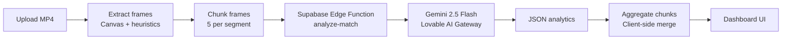

# Field Vision AI

**AI-powered football match analytics from video footage** — upload a match recording and get tactical insights, team stats, player performance, momentum timelines, and predictions in a live dashboard.

[](https://field-vision-ai-sooty.vercel.app)
[](https://www.typescriptlang.org/)
[](https://react.dev/)
[](https://supabase.com/)

---

## Overview

Field Vision AI (branded **FootballAI** in the app) turns raw match video into structured analytics. The browser extracts frames from your footage, sends them to a Supabase Edge Function, and uses **Google Gemini 2.5 Flash** (via the Lovable AI gateway) to produce evidence-based tactical analysis. Results stream into an interactive dashboard as each segment completes.

**Live app:** [field-vision-ai-sooty.vercel.app](https://field-vision-ai-sooty.vercel.app)

---

## Features

| Area | What you get |
|------|----------------|
| **Video ingest** | Drag-and-drop or file picker for `.mp4` match footage |
| **Smart frame extraction** | Client-side sampling every 15s with pitch-detection heuristics (green turf + player density) |
| **Full-match analysis** | Chunked pipeline processes long games segment-by-segment with incremental UI updates |
| **Team analytics** | Possession, pass accuracy, pressing, formation, attacking third, defensive strength |
| **Player insights** | Fatigue, activity, heat zones, sprints, performance ratings |
| **Match momentum** | Time-series chart of home vs away momentum across the game |
| **Predictions** | Likely scoreline, win probabilities, next goal, expected goals |
| **Tactical suggestions** | Prioritized coaching recommendations per team |
| **Key events** | Timestamped highlights with significance levels |
| **Frame gallery** | Thumbnails of frames actually sent to the AI for transparency |

---

## How it works



1. **Frame extraction** — The video is seeked at 15-second intervals. Each frame is drawn to a 480×270 canvas, compressed as JPEG, and kept only if it looks like match footage (sufficient green pitch + non-background pixels).
2. **Chunked AI calls** — Frames are grouped into chunks of 5 and sent sequentially to the `analyze-match` edge function to stay within payload limits and improve reliability on long matches.
3. **Vision analysis** — Gemini receives ordered image frames plus a strict JSON schema prompt focused on observable evidence (no fabricated stats).
4. **Aggregation** — Team metrics are averaged across chunks; events and momentum timelines are merged and sorted; possession is normalized to sum to 100%.
5. **Live dashboard** — React components render stats, charts, and tables with Framer Motion transitions as partial results arrive.

---

## Tech stack

### Frontend
- **React 18** + **TypeScript** + **Vite** (SWC)
- **Tailwind CSS** + **shadcn/ui** (Radix primitives)
- **Framer Motion** — page and card animations
- **Recharts** — momentum area chart
- **TanStack Query** — data layer (ready for future API caching)
- **React Router** — single-page routing

### Backend & AI
- **Supabase Edge Functions** (Deno) — `analyze-match`
- **Google Gemini 2.5 Flash** — multimodal frame analysis
- **Lovable AI Gateway** — authenticated model access

### Tooling
- **Vitest** + Testing Library — unit test setup
- **ESLint 9** — linting
- **Bun / npm** — package management (lockfiles for both)

---

## Project structure

```
field-vision-ai/
├── src/
│   ├── pages/Index.tsx          # Main upload + dashboard orchestration
│   ├── lib/matchAnalysis.ts     # Frame extraction, chunking, aggregation
│   ├── components/              # VideoUpload, charts, tables, panels
│   ├── integrations/supabase/   # Typed Supabase client
│   └── components/ui/           # shadcn/ui primitives
├── supabase/
│   ├── functions/analyze-match/  # Edge function → Gemini
│   └── config.toml
├── public/
├── index.html
└── vite.config.ts
```

---

## Getting started

### Prerequisites

- **Node.js** 18+ (or [Bun](https://bun.sh))
- A **Supabase** project with Edge Functions enabled
- A **Lovable API key** (`LOVABLE_API_KEY`) set as a Supabase secret for the edge function

### 1. Clone and install

```bash
git clone https://github.com/lakshyaarora04/field-vision-ai.git
cd field-vision-ai
npm install
# or: bun install
```

### 2. Environment variables

Create a `.env` file in the project root:

```env
VITE_SUPABASE_URL=https://your-project.supabase.co
VITE_SUPABASE_PUBLISHABLE_KEY=your-anon-key
VITE_SUPABASE_PROJECT_ID=your-project-id
```

> Never commit `.env` files or expose service-role keys in the frontend. Only the **anon/publishable** key belongs in `VITE_*` variables.

### 3. Deploy the edge function

From the project root, with the [Supabase CLI](https://supabase.com/docs/guides/cli) linked to your project:

```bash
supabase secrets set LOVABLE_API_KEY=your_lovable_api_key
supabase functions deploy analyze-match
```

### 4. Run locally

```bash
npm run dev
```

The dev server starts on **http://localhost:8080** (configured in `vite.config.ts`).

### Other scripts

| Command | Description |
|---------|-------------|
| `npm run build` | Production build to `dist/` |
| `npm run preview` | Preview production build |
| `npm run lint` | Run ESLint |
| `npm run test` | Run Vitest once |
| `npm run test:watch` | Vitest in watch mode |

---

## Analytics schema

The AI returns structured JSON consumed by `MatchAnalytics` in `src/lib/matchAnalysis.ts`:

- `teamAnalysis` — home/away stats (possession, passing, pressing, formation, etc.)
- `playerAnalysis[]` — per-player fatigue, activity, ratings
- `matchMomentum[]` — `{ minute, homeTeamMomentum, awayTeamMomentum }`
- `keyEvents[]` — description, timestamp, significance
- `predictions` — scoreline, win probability, xG
- `tacticalSuggestions[]` — team, suggestion, priority, impact
- `overallMatchRating`, `matchPhase`, `intensity`

---

## Deployment

The app is deployed on **Vercel** at [field-vision-ai-sooty.vercel.app](https://field-vision-ai-sooty.vercel.app).

Typical Vercel setup:

1. Connect the GitHub repository
2. Set `VITE_SUPABASE_URL` and `VITE_SUPABASE_PUBLISHABLE_KEY` in project environment variables
3. Build command: `npm run build` — output directory: `dist`

Ensure the Supabase edge function is deployed and `LOVABLE_API_KEY` is configured before testing production uploads.

---

## Design notes

- **Dark sports-analytics theme** — Orbitron headings, Inter body text, primary/accent team colors
- **Incremental UX** — Dashboard populates as each video chunk finishes analyzing
- **Resilient pipeline** — Failed chunks are skipped; analysis continues with remaining segments
- **Evidence-first prompts** — System instructions require the model to base metrics on visible frame content

---

## Limitations & roadmap

- Analysis quality depends on video resolution, camera angle, and visible jersey numbers
- Frame sampling (every 15s, max 60 frames) trades completeness for API payload limits
- Player identification is best-effort when numbers are not visible
- No persistent match history or user accounts yet (Supabase auth client is wired for future use)

---

## License

This project is open source. See the repository for license details.

---

## Author

Built by [lakshyaarora04](https://github.com/lakshyaarora04).
